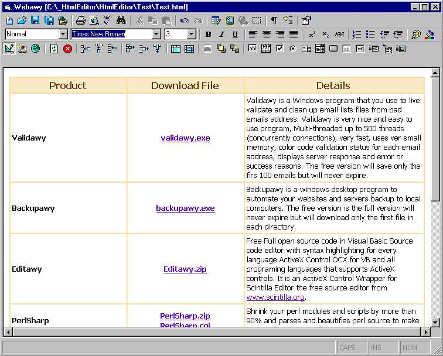



## MSHTML ActiveX Control Wrapper\. WYSIWYG HTML Editor Component

### Description

MSHTML ActiveX Control Wrapper WYSIWYG full visual html editor component. Support every single function supported by MSHTML using IOleCommandTarget Interface. Supports also all table editing functions. I started also table selection functions that you can complete it the way it should. ALso support events and functions names similar to discontinued DhtmlEdit control. Very easy to use. Before you load the project copy the Typelib file MewsoftHtmlEditor.tlb to your system directory. You can download the full project source code with the ActiveX OCX compiled from our site http://www.mewsoft.com/Downloads/ and get also the latest version. Please post any enhancements or updates.
 
### More Info
 

             |
---                |---
**Submitted On**   |2006-03-13 18:09:34
**By**             |[Ahmed Amin Elsheshtawy](https://github.com/Planet-Source-Code/PSCIndex/blob/master/ByAuthor/ahmed-amin-elsheshtawy.md)
**Level**          |Advanced
**User Rating**    |5.0 (25 globes from 5 users)
**Compatibility**  |VB 3\.0, VB 4\.0 \(16\-bit\), VB 4\.0 \(32\-bit\), VB 5\.0, VB 6\.0, VB Script, ASP \(Active Server Pages\) , VBA MS Access, VBA MS Excel
**Category**       |[Internet/ HTML](https://github.com/Planet-Source-Code/PSCIndex/blob/master/ByCategory/internet-html__1-34.md)
**World**          |[Visual Basic](https://github.com/Planet-Source-Code/PSCIndex/blob/master/ByWorld/visual-basic.md)
**Archive File**   |[MSHTML\_Act1979963132006\.zip](https://github.com/Planet-Source-Code/ahmed-amin-elsheshtawy-mshtml-activex-control-wrapper-wysiwyg-html-editor-component__1-64650/archive/master.zip)

